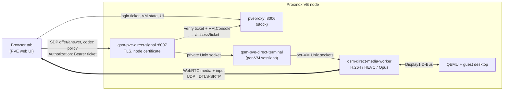

# QSM Direct

**A real desktop inside the Proxmox web console.** QSM Direct replaces the
rectangle-by-rectangle noVNC picture with a 60 fps WebRTC stream — encoded in
hardware where the node has NVENC, QSV or VA-API, on the CPU otherwise — in
the same browser tab, with the same PVE login and the same `VM.Console`
permission. Nothing to install on the client, and nothing patched inside
pveproxy or pvedaemon: they run stock.



The browser reaches the node on two TLS ports: stock pveproxy on 8006 for
login, VM state and the UI, and the QSM signalling service on 8007 for the
one SDP exchange and the codec policy. The signalling service authorises
every call by asking pveproxy's own `/access/ticket` to confirm the browser's
ticket and `VM.Console`; the audio, video and input then flow directly as
WebRTC between the browser and the node's media worker.

## Why it feels like a local desktop

Open the **Console** of a VM and:

- **Video plays as video.** A 30 fps 720p clip reaches the browser as 27–28
  distinct pictures per second. Stock noVNC on the same guest shows about 7
  pictures per second and needs six times the bandwidth to do it.
- **Scrolling and animation stay smooth.** Every guest frame is encoded at a
  constant cadence. In the same lab, with the same guest image, a scrolling
  document reaches the browser as 36 pictures per second with a 39 ms p95 gap
  between pictures under VirGL + QSM Direct; noVNC on that node manages 12
  pictures per second with a 134 ms gap. On a node with an RTX 3080 the same
  document reaches 52 pictures per second with a 34 ms gap.
- **Mouse motion cannot queue up.** Pointer positions travel on their own
  unordered, latest-state lane, so a lost or late packet is replaced by the
  next position instead of delaying a click or piling up behind a busy frame.
- **It uses the hardware you have.** NVENC, QSV, VA-API or `libx264`; H.264
  by default, HEVC as an explicit experimental per-VM choice; VirGL/GL guests
  or plain VGA guests.
- **Same login, same ACL.** Same origin, same PVE session, same
  `VM.Console` permission. No pairing PIN, no persistent public service port,
  no native client, no host X11 session.
- **A sleeping guest is explained, not hidden.** When the guest blanks its
  screen or locks, the console says so and any mouse or key press wakes it.

## QSM Direct against stock noVNC, measured

Three ways to look at a PVE 9 virtual machine, measured on 2026-09-07 with one
guest image, one browser host and the same workloads in a CPU-only nested lab
(`libx264` on the node, 4-vCPU guests with software rendering — the guest
itself caps the frame rate in every column). "Pictures/s" counts *visibly
different* pictures reaching the browser each second; the gap is the p95 pause
between two of them. Method, environments, raw numbers and reproduction
commands: [docs/COMPARISON.md](docs/COMPARISON.md).

**Motion — pictures/s, p95 gap**

| Workload in the VM | VirGL + QSM Direct | Standard VGA + QSM Direct | Standard VGA + stock noVNC | VirGL + stock noVNC |
| --- | ---: | ---: | ---: | ---: |
| 720p clip, 30 fps source | source rate¹, 39 ms | 26.6, 67 ms | 7.4, 175 ms | no picture³ |
| Scrolling a long document | 36.2, 39 ms | 14.4, 118 ms | 12.0, 134 ms | no picture³ |
| Animated UI, dashboards | 38.5, 34 ms | 16.2, 115 ms | 11.0, 152 ms | no picture³ |

**Cost and capabilities**

| | VirGL + QSM Direct | Standard VGA + QSM Direct | Standard VGA + stock noVNC | VirGL + stock noVNC |
| --- | ---: | ---: | ---: | ---: |
| Bandwidth, 720p clip | 18.8 Mbit/s | 19.6 Mbit/s | 120 Mbit/s | — |
| Bandwidth, animated UI | 12.8 Mbit/s | 9.0 Mbit/s | 31.6 Mbit/s | — |
| Bandwidth, idle desktop | 0.55 Mbit/s | 0.55 Mbit/s | ≈ 0 | — |
| Pointer onto an icon → hover popup⁴ | 65 ms | 76 ms | see note⁴ | no picture³ |
| Window drag → painted motion⁴ | 81 ms, 39 px lag | 216 ms, 50 px lag | see note⁴ | no picture³ |
| Console opens to first picture | 3.4 s | 3.4 s | 1.0 s | — |
| Guest resolution follows the window | yes | no (fixed mode, scaled) | no | — |
| Guest OpenGL / 3D applications | yes | no | no | no |
| Node CPU per open console (`libx264`) | ≈ ½ core² | ≈ ½ core² | none | — |
| Needed on the node | a DRM render device (`/dev/dri/renderD*`) + any encoder | any encoder | nothing | — |

¹ The sampler counted 37.5 pictures/s on the VirGL guest, above the clip's
30 fps: the software-GL guest presents intermediate partial updates that the
change detector counts. Read it as "the full source rate".
² Lifetime average of the worker process during the animated scene on the
nested node; NVENC on the RTX 3080 node used 13 % of the GPU and 4 % of its
encoder during the same workload.
³ The VirGL profile sets the PVE graphics card to *none*, so QEMU's VNC
server has no 2D framebuffer to serve: stock noVNC on a VirGL VM stays black.
The guest is visible only through QSM Direct while that profile is active.
⁴ Measured with `lab/proxmox9/measure-interaction.cjs`, timing from the
browser's own mouse-event to the painted response (median of five hover runs;
one drag run). The earlier "hover ≈ 65 ms, noVNC faster" figure was a
measurement artifact — its clock started before the pointer move was even
injected. With the corrected clock QSM's hover is 65–76 ms; the harness could
not drive stock noVNC's fixture hover/drag reliably, so its interaction
latency is not quoted here rather than published as a number we do not trust.

The same VirGL + QSM Direct workloads on a real node with an **RTX 3080**
(NVENC H.264, an Ubuntu 26.04 KDE guest) reached 28 pictures/s for the 30 fps
clip with 0 dropped frames, **52 pictures/s** for the scrolling document and
**45 pictures/s** for the animated scene, with 34–67 ms p95 gaps.

Where noVNC is still the better tool: the first picture after opening the
Console (it needs no codec negotiation), zero bandwidth on an idle screen,
and anything before an OS is running — firmware, installers, recovery, text
consoles — on a VM that still has a VNC server (the Standard VGA profile, not
VirGL). QSM Direct is for the hours you spend *inside* a running desktop.

## Requirements

- **Proxmox VE 9** (`pve-manager` 9.x). Nothing is loaded into pveproxy or
  pvedaemon, so there is no pinned-version requirement: a PVE point-release
  upgrade does not disable the console. The only PVE contract used is the
  documented `/access/ticket` authorisation endpoint.
- **Browser:** any browser whose WebRTC offers H.264 and Opus — Chrome, Edge,
  Chromium with proprietary codecs, Safari; Firefox with its OpenH264 plugin
  enabled. A browser without H.264 is refused (the reason is logged in the
  node journal). Because the console fetches the signalling port
  cross-origin, reach PVE by a host name the node certificate is valid for
  (or install a trusted certificate); a certificate the browser only accepts
  after a click-through works for the main page but blocks the signalling
  fetch.
- **Network:** the browser reaches the node on TCP 8006 (stock pveproxy) and
  TCP 8007 (the QSM signalling service, TLS with the node certificate). The
  picture is WebRTC: for each open console the node binds a UDP socket on a
  random high port and advertises its own addresses as ICE host candidates
  (no STUN or TURN, no TCP fallback, DTLS-authenticated). A host firewall
  must allow inbound TCP 8007 and inbound UDP from operator networks.
- **Encoder:** NVENC, QSV or VA-API with the vendor driver, or the CPU
  (`libx264`, about half a core per open 1280×800 console). HEVC needs a
  hardware encoder.
- **Clusters:** install the package on every node that may run the VM. The
  Display1 profile references a node-local socket, so a VM with QSM Display1
  enabled starts only where the terminal service is running. Live migration of
  such a VM has not been qualified.
- **Capacity:** up to 16 concurrent console sessions per node; the terminal
  service and all its encoder workers run under a 1 GiB `MemoryMax`, which a
  systemd drop-in can raise.

## Install

Build the PVE 9 package on Debian 13 with
`packaging/debian/build-qsm-pve-direct-deb.sh` (or in a throwaway chroot with
`scripts/build-qsm-pve-direct-in-trixie.sh`; needs cmake, ninja, the FFmpeg
development libraries and libopus), then install it on the PVE node:

```bash
apt install ./qsm-pve-direct_*.deb
systemctl enable --now qsm-pve-direct-terminal.service qsm-pve-direct-signal.service
```

What it changes on the node: two new systemd services —
`qsm-pve-direct-terminal` (Unix sockets only, no listening port) and
`qsm-pve-direct-signal` (one TLS port, 8007, using the node certificate); a
patched `index.html.tpl` that adds one script tag (the stock template is
restored on removal and on an unknown `pve-manager` version); and a per-VM
policy directory `/etc/qsm-pve-direct/instances.d`. It does **not** modify
`pveproxy`, `pvedaemon` or any PVE Perl file. Removing the package restores
the template and stops both services.

Log in as `root@pam` (enabling QSM Display1 edits the VM's `args:` line,
which Proxmox reserves for root), open **Hardware → Display → Advanced** of a
VM, enable **QSM Display1** and pick a profile:

- **VirGL GPU (GL)** adds a private `virtio-vga-gl` and a GL D-Bus Display1 —
  the smooth column above, with guest 3D. It sets the PVE graphics card to
  *none*: the VM has no VNC server while this profile is active, so stock
  noVNC (including firmware and installer output) is available again only
  after switching back to the CPU profile and restarting the VM.
- **CPU — Standard VGA or VirtIO (no GL)** keeps the selected adapter and adds
  a non-GL D-Bus Display1 — no GPU or render device required; stock VNC keeps
  working next to it. Pick **VirtIO** if you want the guest resolution to
  follow the console window; Standard VGA keeps its own mode and is scaled.

**Save, then stop and start the VM** — a reboot from inside the guest is not
enough, QEMU must be relaunched with the new display. Then use the existing
**Console** entry in the left navigation, between **Summary** and
**Hardware**: an eligible VM gets QSM Direct embedded right there, an
ineligible VM keeps the ordinary noVNC console, and the top **Console** split
menu opens QSM Direct in a separate window. Opening the console needs
`VM.Console`; saving the per-VM codec policy needs `VM.Config.Options`.

Full screen is the same console at the full viewport. Bidirectional clipboard
comes with `qsm-desktop-agent` in a Linux guest running a Wayland desktop
(KDE Plasma Wayland, or another compositor with `wl-clipboard` installed):
`qsm-desktop-agent-setup USER`. File transfer is deliberately not part of the
browser transport.

Details: [installation](docs/INSTALLATION.md), [testing](docs/TESTING.md),
[measured comparison](docs/COMPARISON.md), [PVE 9 laboratory](lab/proxmox9/README.md).

## How it works

The browser sends its WebRTC offer to the node-local signalling service
(`qsm-pve-direct-signal`, TLS 8007). PVE has no supported way to add an API
route, so the service does not touch pveproxy or pvedaemon: it authorises the
request by relaying the browser's ticket to the node's own `/access/ticket`
with `path=/vms/<vmid>` and the required privilege, and only the username PVE
confirms is used. The ticket travels in an `Authorization: Bearer` header, not
an ambient cookie, so the endpoint is CSRF-safe. On success the service hands
the offer to the terminal over a private Unix socket; the terminal starts one
media worker per VM. The worker reads QEMU's Display1 (GL scanouts through
DMA-BUF, or plain framebuffers), encodes H.264 or HEVC, and hands the
elementary stream to the WebRTC bridge, which only packetizes — nothing is
decoded or re-encoded on the way. Input goes back through Display1: keys and
clicks on an ordered channel, pointer motion on the unordered latest-state
lane. A session lives as long as its WebRTC peer is connected and is reclaimed
ten minutes after a browser vanishes.

All viewers of one VM share one encoder stream. The first Console picks the
codec; a later browser that cannot decode it is refused rather than handed
mislabelled video (the reason is logged in the node journal).

**Audio:** the worker and the WebRTC bridge carry Opus audio from QEMU's
Display1 audio interface, but the PVE Display profile does not yet add a QEMU
audio device or `audiodev` to the VM, so a console configured as described
above is silent. Treat audio as not available until the profile gains it.

### Codecs

The VM media policy defaults to **Automatic (H.264)**: NVENC, QSV or VA-API
when one initializes, `libx264` otherwise. HEVC is an explicit, experimental
per-VM policy: the terminal then requires `video/H265` in the browser's SDP
offer *and* a bounded probe that initialized `hevc_nvenc`, `hevc_qsv` or
`hevc_vaapi` on the node, and packetizes the stream per
[RFC 7798](https://www.rfc-editor.org/rfc/rfc7798.html). The HEVC lane is
covered by the encoder probe and bridge tests only: the one real browser that
negotiated it on the reference node (Chrome with hardware HEVC, `hevc_nvenc`)
requested a keyframe thirteen times in three seconds and never presented a
picture, so it is not selected automatically. HEVC lowers bitrate, not input
latency: encoder look-ahead, keyframe cadence, browser decode and jitter
buffering still decide the interaction delay.

### Sleeping and locked guests

A desktop guest blanks its output after an idle timeout or locks its session,
and then ignores a requested display mode until it wakes. After about four
seconds of an all-black picture the console shows *Guest display looks asleep.
Move the mouse or press a key here to wake it.*; a guest that keeps its own
size says *Guest display kept its own size. If the guest is asleep or locked,
move the mouse or press a key here.* Every mouse or key event re-issues the
pending window size once, and the status returns to *Connected* within about a
second of the guest painting or adopting the size. Measured on a KDE Plasma
guest with `lab/proxmox9/probe-display-sleep-recovery.cjs` (250 ms sampling):
the desktop is back within the first sample after the wake input, and never
without one.

## License

GPL-3.0-or-later for the media worker, the terminal, the bridge and the
build tooling; the Proxmox integration files (the API module under
`integration/proxmox/pve9/direct_api` and the console script under
`integration/proxmox/pve9/direct_ui`) are AGPL-3.0-or-later. See
[LICENSE](LICENSE).
